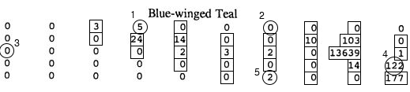

```{r, include=FALSE}
knitr::opts_chunk$set(collapse=TRUE, prompt=TRUE, comment=NULL,tidy.opts=list(width.cutoff=60),tidy=TRUE,eval=TRUE, out.width = "60%", fig.align = "center")
library(ggplot2)
library(dplyr)
library(survey)
library(SDaA)
library(gridExtra)
library(tidyverse)
library(knitr)
```

### Problem 1

$\pi_{B} = \pi_{BA} + \pi_{BC} + \pi_{BD} = [P(A_1)P(B_2|A_1) + P(B_1)P(A_2|B_1)] + [P(C_1)P(B_2|C_1) +  P(B_1)P(C_2|B_1)] + [P(D_1)P(B_2|D_1) +  P(B_1)P(D_2|B_1)] = \dfrac{1}{16}\dfrac{2}{16-1} + \dfrac{2}{16}\dfrac{1}{16-2} + \dfrac{3}{16}\dfrac{2}{16-3} + \dfrac{2}{16}\dfrac{3}{16-2} + \dfrac{10}{16}\dfrac{2}{16-10} + \dfrac{2}{16}\dfrac{10}{16-2}$ = `r round(1/16*2/(16-1) + 2/16*1/(16-2) + 3/16*2/(16-3) + 2/16*3/(16-2) + 10/16*2/(16-10) + 2/16*10/(16-2), digits = 4)`\

$\pi_{D} = \pi_{DA} + \pi_{DB} + \pi_{DC} = [P(A_1)P(D_2|A_1) + P(D_1)P(A_2|D_1)] + [P(B_1)P(D_2|B_1) +  P(D_1)P(B_2|D_1)] + [P(C_1)P(D_2|C_1) +  P(D_1)P(C_2|D_1)] = \dfrac{1}{16}\dfrac{10}{16-1} + \dfrac{10}{16}\dfrac{1}{16-10} + \dfrac{2}{16}\dfrac{10}{16-2} + \dfrac{10}{16}\dfrac{2}{16-10} + \dfrac{3}{16}\dfrac{10}{16-3} + \dfrac{10}{16}\dfrac{3}{16-10}$ = `r round(1/16*10/(16-1) + 10/16*1/(16-10) + 2/16*10/(16-2) + 10/16*2/(16-10) + 3/16*10/(16-3) + 10/16*3/(16-10), digits = 4)`\

$\pi_{BD} = P(D_1)P(B_2|D_1) +  P(B_1)P(D_2|B_1) = \dfrac{10}{16}\dfrac{2}{16-10} + \dfrac{2}{16}\dfrac{10}{16-2}$ = `r round(10/16*2/(16-10) + 2/16*10/(16-2), digits = 4)`

$t_B = 20$, $t_D = 245$\

$\hat{t}_{HT} = \sum\limits_{i \in S} \dfrac{t_i}{\pi_i} = \dfrac{20}{0.3705} + \dfrac{245}{0.9002}$ = `r 20/0.3705 + 245/0.9002`\

$\hat{V}(\hat{t}_{HT}) = \dfrac{(1-0.9002)(245)^2}{0.9002^2} + \dfrac{(1-0.3705)(20)^2}{0.3705^2} +2\dfrac{0.2976-(0.9002)(0.3705)}{0.2976}(\dfrac{245}{0.9002})(\dfrac{20}{0.3705})$ = `r (1-0.9002)*(245)^2/(0.9002^2) + (1-0.3705)*(20)^2/(0.3705^2) +2*((0.2976-(0.9002)*(0.3705))/0.2976)*245/0.9002*20/0.3705`

$\hat{V}_{SYG}(\hat{t}_{HT}) = \dfrac{(0.9002)(0.3705)-0.2976}{0.2976}(\dfrac{245}{0.9002}-\dfrac{20}{0.3705})^2$ = `r (0.9002*0.3705-0.2976)/0.2976*(245/0.9002-20/0.3705)^2`\

$\hat{V}_{SYG}(\hat{t}_{HT})$ is slightly bigger than $\hat{V}(\hat{t}_{HT})$

### Problem 2
Lohr textbook ch. 6 exercise 24(a).\

$\pi_{1} = \pi_{12}+\pi_{13}+\pi_{14} = 0.31+0.20+0.14$ = `r 0.31+0.20+0.14`\
$\pi_{2} = \pi_{21}+\pi_{23}+\pi_{24} = 0.31+0.03+0.01$ = `r 0.31+0.03+0.01`\
$\pi_{3} = \pi_{31}+\pi_{32}+\pi_{34} = 0.20+0.03+0.31$ = `r 0.20+0.03+0.31`\
$\pi_{4} = \pi_{41}+\pi_{42}+\pi_{43} = 0.14+0.01+0.31$ = `r 0.14+0.01+0.31`

### Problem 3
```{r}
agpps <- read.csv("http://math.carleton.edu/kstclair/data/agpps.csv")

probs <- as.matrix(agpps[,10:24])
diag(probs) <- agpps$pii

agpps.design <- svydesign(id=~1, fpc=~pii, data=agpps, pps = ppsmat(probs))
```

**(a)**

```{r}
svytotal(~farms92, agpps.design)
```

$\hat{t}_{HT} = 1549517$, $SE[\hat{t}_{HT}] = 354030$

**(b)**

```{r}
agsrs$n <- nrow(agsrs)
agsrs$N <- 3078
agsrs$wts <- agsrs$N/agsrs$n
agsrs.design <- svydesign(id=~1, fpc= ~N, weights= ~wts, data=agsrs)
svytotal(~farms92, agsrs.design)

acres <- ggplot(agpps) +
  geom_point(aes(y = acres92, x = pii)) +
  labs(x = "Pi_i", title = "acres92 v. Pi_i")

farms <- ggplot(agpps) +
  geom_point(aes(y = farms92, x = pii)) +
  labs(x = "Pi_i", title = "farms92 v. Pi_i")

grid.arrange(acres,farms, ncol = 2)

cor(agpps$acres92, agpps$pii)
cor(agpps$farms92, agpps$pii)
```

$SE[\hat{t}_{srs}]$ = 67908 < $SE[\hat{t}_{HT}] = 354030$\

When $\pi_i$ is positively related with the response variable ($t_i$), PPS can enhance the precision relative to SRS (in that $\pi_i$ is constructed based on `acres87`, and as `acres87` is positively associated with `acres92`, pps reduces the variability in a similar mechanism as the ratio estimates using auxiliary variable). The scatterplot suggests that there is a strong positive correlation (r = `r cor(agpps$acres92, agpps$pii)`) between $\pi_i$ and `acres92` but not with `farms92` (r = `r cor(agpps$farms92, agpps$pii)`). PPS estimate may produce imprecision when $\pi_i$ is small. In the case of `acres92`, PPS estimate enhances the precision relative to SRS because the precision gained from the positive association between $\pi_i$ and $t_i$ surpasses the imprecision caused from small $\pi_i$, whereas pps estimate of `farms92` rather produces more imprecise result due to the absence of a strong positve relationship between $\pi_i$ and $t_i$. 

\newpage

**(e)**

```{r}
probs.wolf <- matrix(c(0.8998871, 0.899871,0.5075547,0.899871, 0.9802246, 0.5715625, 0.5075547, 0.5715625, 0.5904), nrow=3,byrow=T)
pi.wolf <- c(0.8998871, 0.9802246,0.5904)
y.wolf <- c(1,2,2)
wolves <- data.frame(y.wolf,pi.wolf,probs.wolf)
wolves
wolves.design<- svydesign(id=~1, fpc=~pi.wolf, data=wolves, pps=ppsmat(probs.wolf))
svytotal(~y.wolf,wolves.design) 
```

$SE[\hat{t}_{HT}] = 2.1144$


### Problem 5

**(a)**

```{r, out.width = "100%"}
set.seed(70)
initial <- sample(1:50, 5, replace = F)
initial


```

Network 1: {3,4,14,15,25,26,27}\
Network 2: {7}\
Network 3: {11}\
Network 4: {18,19,29,30,39,40,50}\
Network 5: {47}

**(b)**

$y^*_1 = 3+5+24+14+2+3+2$ = `r 3+5+24+14+2+3+2`, $x^*_1 = 7$\
$y^*_2 = 0$, $x^*_2 = 1$\
$y^*_3 = 0$, $x^*_3 = 1$\
$y^*_4 = 10+103+13639+1+14+122+177$ = 14066, $x^*_4 = 7$\
$y^*_5 = 2$, $x^*_5 = 1$\

```{r}
bluewinged_data <- data.frame(
  y_net = c(53,0,0,14066,2),
  x_net = c(7,1,1,7,1))

n1 <- 5
N <- 50
bluewinged_data$pi_single <- 1- choose(N - bluewinged_data$x_net,n1)/choose(N,n1)

jnt_fun <- function(xj,x=bluewinged_data$x_net,N=50,n1=5){
  1- choose(N - xj,n1)/choose(N,n1) - choose(N - x,n1)/choose(N,n1) + choose(N - xj-x,n1)/choose(N,n1)
}

jnt_mat <- matrix(
  c(jnt_fun(bluewinged_data$x_net[1]),
    jnt_fun(bluewinged_data$x_net[2]),
    jnt_fun(bluewinged_data$x_net[3]),
    jnt_fun(bluewinged_data$x_net[4]),
    jnt_fun(bluewinged_data$x_net[5])),
  byrow=TRUE, nrow=5)

diag(jnt_mat) <- bluewinged_data$pi_single

bluewinged_design <- svydesign(id = ~1, fpc= ~pi_single, pps=ppsmat(jnt_mat), data=bluewinged_data)

svytotal(~y_net, bluewinged_design)
confint(svytotal(~y_net, bluewinged_design), df = 4)
```

$SE[\hat{t}_{HT}] = 17355$\
95% CI: (-22290.54, 74078.95)\
True t = 14121\

The interval contains the true t value. 

